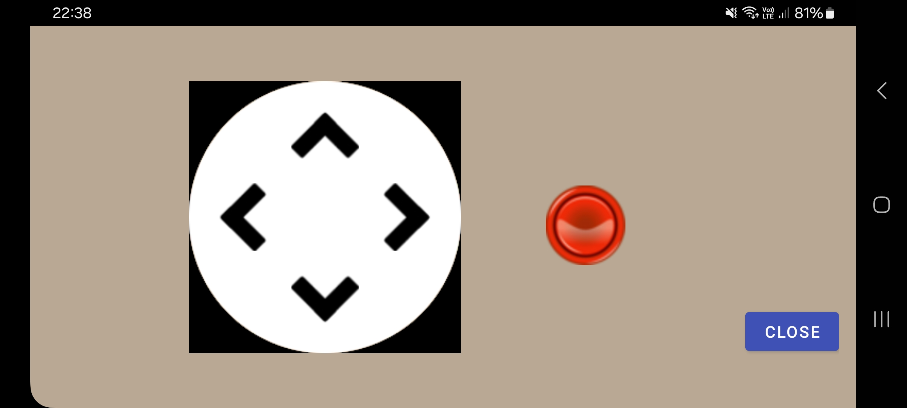

# C64 Emulator on an ESP32-S3 with BLE keyboard for development board Lilygo T-HMI

C64 emulator for the development board Lilygo T-HMI equipped with an ESP32-S3 chip, a 2.8 inch touch display LCD screen (ST7789V driver) and a SD card slot.
The keyboard for the emulator is simulated by an Android app, communication between the app and the emulator is realized using BLE (Bluetooth Low Energy).

## Hardware

From [Xinyuan-LilyGO/T-HMI](https://github.com/Xinyuan-LilyGO/T-HMI):

### ESP32-S3

The ESP32-S3 is dual core containing a Protocol CPU (known as CPU 0, core 0 or PRO_CPU) and an Application CPU (known as CPU 1, core 1 or APP_CPU).
The two cores are identical in practice and share the same memory.
The tasks responsible for handling wireless networking (Wi-Fi or Bluetooth) are pinned to core 0 by default
(see [Espressif - Task Priorities](https://docs.espressif.com/projects/esp-idf/en/v5.0/esp32s3/api-guides/performance/speed.html)).

For this project core 0 is used to copy the graphic bitmap to LCD.
Emulation of the CPU and the custom chips (VIC and CIAs) are done on core 1.

### Display

The 2.8 inch ST7789V TFT LCD has a resolution of 240x320 pixel and an 8 bit parallel interface.

The display can be rotated to support the resolution of a C64 (320x200).

### Joystick

I connected an "Arduino joystick shield" to the T-HMI development board.
The joystick is optional (as there exists also a virtual joystick on the Android device) but recommended.
It has an analog 2-axis thumb joystick and several buttons.
As there are several games which use the space bar as a second fire button (e.g. Commando), another button of the Arduino joystick
can be used to simulate the pressing of the space bar.

Connections:

- connect T-HMI IO16 to Arduino Y pin (yellow cable)
- connect T-HMI IO15 to Arduino X pin (white cable)
- connect T-HMI VDD to Arduino V pin (red cable)
- connect T-HMI GND to Arduino G pin (black cable)
- connect T-HMI IO18 to Arduino D pin (for D button, yellow cable)
- optional: connect T-HMI IO17 to Arduino B pin to simulate pressing the space bar (for B button, white cable)

Switch voltage to 3.3V on the Arduino module.

If you do not use an Arduino joystick or choose to use other pins on the development board,
you may have to adapt the following constants in src/Config.h:

- ADC_JOYSTICK_X
- ADC_JOYSTICK_Y
- JOYSTICK_FIRE_PIN
- JOYSTICK_FIRE2_PIN

## Installation

### Files

- build/*.bin : Binary files of the C64 emulator to be uploaded to the T-HMI
- THMIC64KB/thmic64kb.apk : Android APK file to be uploaded to your Android smartphone
- T-HMI-C64.ino : Arduino .ino file of the C64 emulator, use in the Arduino IDE to upload the emulator to the T-HMI
- src/* : C64 emulator source code
- THMIC64KB/app/src/ : source code of Android app
- Makefile : used to install development environment and to compile + upload code

### Install C64 Emulator

I use arduino-cli to upload the provided binary files to the development board:

- Download arduino-cli for your platform (download section from https://arduino.github.io/arduino-cli/0.35/installation/),
  unpack the binary and place it in a directory included in the search path of executables (e.g. /usr/local/bin on a linux system).
- You may have to install python3 and python3-serial if not already installed. On my linux system I had to install python3-serial:  
  sudo apt install python3-serial
- You may have to install esptool to flash the microcontroller if not already installed:  
  pip install esptool
- Execute arduino-cli with the correct parameters (you may have to replace "/dev/ttyACM0" with the name of the serial port on your system):  
  arduino-cli upload -p /dev/ttyACM0 --fqbn esp32:esp32:esp32s3:CDCOnBoot=cdc,DFUOnBoot=dfu,FlashSize=16M,JTAGAdapter=builtin,PartitionScheme=huge_app,PSRAM=opi,LoopCore=0,DebugLevel=info -i build/T-HMI-C64.ino.bin

If you want to install the development environment, you can use the provided Makefile (which itself uses arduino-cli) or you can use the Arduino IDE.

#### Install development environment using Makefile (*not* necessary to run the emulator)

- Download arduino-cli for your platform (download section from https://arduino.github.io/arduino-cli/0.35/installation/),
  unpack the binary and place it in a directory included in the search path of executables (e.g. /usr/local/bin on a linux system).
- You may have to install GNU make if not already installed.
- Install required Arduino core and libraries using the following command in the directory T-HMI-C64:  
  make install
- You may have to install python3 and python3-serial if not already installed. On my linux system I had to install python3-serial:  
  sudo apt install python3-serial
- You may have to install the esptool to flash your microcontroller if not already installed:  
  pip install esptool
- You may have to adapt the file Makefile and change the name of the serial port (adapt variable PORT).
- On a linux system you may have to add the group dialout to your user to be able to upload code as a normal user:  
  sudo usermod -a -G dialout your-username  
  (You have to logout and login again to get the group get active.)
- Compile code:  
  make
- Upload code:  
  make upload

#### Install development environment using Arduino IDE (*not* necessary to run the emulator)

From [Xinyuan-LilyGO/T-HMI](https://github.com/Xinyuan-LilyGO/T-HMI):
In Arduino Preferences, on the Settings tab, enter the [Espressif Arduino ESP32 Package](https://espressif.github.io/arduino-esp32/package_esp32_index.json)
URL in the Additional boards manager URLs input box.
Click OK and the software will install.
Search for ESP32 in Tools → Board Manager and install ESP32-Arduino SDK (V 2.0.5 or above and below V3.0).

Use the following settings in the Tools menu of the Arduino IDE 2.3.2:

| Setting                              | Value                             |
|--------------------------------------|-----------------------------------|
| Board                                | ESP32 S3 Dev Module               |
| Port                                 | /dev/ttyACM0                      |
| USB CDC On Boot                      | Enabled                           |
| CPU Frequency                        | 240MHz (WiFi)                     |
| Core Debug Level                     | None                              |
| USB DFU On Boot                      | Enabled                           |
| Events Run On                        | Core 1                            |
| Flash Mode                           | QIO 80 MHz                        |
| Flash Size                           | 16MB (128Mb)                      |
| JTAG Adapter                         | Integrated USB JTAG               |
| Arduino Runs On                      | Core 0                            |
| USB Firmware MSC On Boot             | Disabled                          |
| Partition Scheme                     | Huge APP (3MB No OTA/1MB SPIFFS)  |
| Upload mode                          | UART0 / Hardware CDC              |
| PSRAM                                | OPI PSRAM                         |
| USB Mode                             | Hardware CDC and JTAG             |
| Core Debug Level                     | Info                              |

The following Arduino libraries are used (all are part of ESP32 Arduino core, version 2.0.0):

- FS
- SD_MMC
- ESP32 BLE Arduino

To upload the emulator from the Arduino IDE just open the file T-HMI-C64.ino
and choose menu Sketch - Upload or press ctrl-u.

### Install Android App

I wrote an Android app which provides a C64 keyboard for the emulator.

However, this app is not available in the Google Play Store - you have to download the APK file
and install it "manually".
You may follow these steps to install the app on your Android device (there may be slight variations depending on your smartphone).

1. Allow installation of APK files from unknown sources:
   - Go to "Settings" on your Android device.
   - Navigate to "Security and Privacy".
   - Navigate to "Additional Security Settings".
   - Navigate to "Install Unknown Apps". A list of installed apps appears. Allow Chrome to install unknown aps.
2. Download the APK file to your Android device: Click [here](https://github.com/retroelec/T-HMI-C64/blob/main/THMIC64KB/thmic64kb.apk)
3. After the app has been downloaded, a message appears which allows you to open the file.
   Click on open and follow the on-screen instructions to complete the installation.

## Usage

### Android keyboard

The emulator starts a BLE (Bluetooth Low Energy) server to receive keystrokes from the Android client.

Once the app is installed and launched, you must accept the requested permissions once
(access to the precise location (*not* coarse location), permission to search for BLE devices).
If you start the emulator (i.e. power on the T-HMI) before starting the app, the app will automatically connect to the BLE server.
Otherwise you can move the "BLE connection" switch to the right to connect to the BLE server. You also have to do this manually
after "hardware reseting" the development board.

As it is not possible to press two keys together on the Android keyboard, the keys Shift, Ctrl and Commodore are special keys
which usually are pressed first, followed by another key to simulate the corresponding key combination.
If it is necessary to send the raw key code of these special keys (e.g. some pinball games use the shift key), you have to
set the corresponding switch in the Android app (DIV screen).
The key combination Run/Stop + Restore has been replaced by first pressing the Commodore key and then pressing the Restore key.

Besides the normal C64 keys this virtual keyboard also provides red extra buttons to send "external commands".
Actually the LOAD, DIV and several JOYSTICK buttons are available:

- LOAD: load a C64 program from SD card
- DIV: opens an extra screen with additional settings / extra functionality
- JOYSTICK 1: connected joystick can be used as a joystick in port 1
- JOYSTICK 2: connected joystick can be used as a joystick in port 2
- KBJOYSTICK 1: "virtual joystick" can be used as a joystick in port 1
- KBJOYSTICK 2: "virtual joystick" can be used as a joystick in port 2

The virtual joystick has some drawbacks in terms of responsiveness.
To play games, a hardware joystick is recommended.

### Load and start a game

You first have to copy C64 games in prg format (only supported format!) to an SD card
(game names must be in lower case letters, max. 16 characters, no spaces in file names allowed, extension must be ".prg", e.g. dkong.prg).
You have to insert the SD card before you power on the T-HMI development board.

As there is no C64 tape/disk drive emulation available up to now, the file must be loaded
into memory using an "external command".
To do this, you first type in the name of the game (without extension ".prg"!) so it shows up on the C64 text screen (e.g. dkong).
You then press the LOAD button on your Android phone (cursor must be on the same line and behind the game title).
If the file is found the text "LOADED" appears on screen, otherwise the text "FILE NOT FOUND" appears.
Afterwards, as usual, you can start the game by typing "RUN" followed by pressing the button RETURN.

## Software

### Class diagram

### Keyboard

Keyboard inputs are sent to the ESP32 via BLE. Three bytes must be sent for each key press:

- Value for the $DC00 register
- Value for the $DC01 register
- Control code:
  - Bit 0 is set when a shift key is pressed
  - Bit 1 is set when the ctrl key is pressed
  - Bit 2 is set when the commodore key is pressed
  - Bit 7 is set when an "external command" is sent

### Emulation status

First of all: This is a hobby project :)

All hardware ports not explicitly mentioned including their corresponding registers are not emulated (e.g. user port and serial port).

"Software stuff" not emulated resp. known bugs (list probably not conclusive):

- no SID emulation (no sound support of development board)
- timing issues (e.g. no linecrunching possible - ESP32 is too slow)
- no tape/disk drive emulation (and no plans to do this)
- VIC yscroll (bit 0-2 of reg. $d011) does not work properly at top and bottom
- not all "illegal" opcodes of the 6502 CPU are implemented yet
- some games have graphic errors
- some games are not working at all

### Games

As there is no disk drive emulation, only "single-load games" can be played.
Up to now I only tested a few games.

Games that are playable:

- Wizard of wor
- Skramble (from anirog)
- Galaxy
- Burnin Rubber
- Lode Runner
- Donkey Kong
- Bubble Bobble
- Castle Terror
- Bagitman
- Krakout
- Miner 2049er
- Dig Dug
- Quartet
- International Soccer
- Choplifter
- Pole Position
- Pole Position 2
- Pacman
- Boulder Dash
- Ghost and Gobblins (graphic errors at top and bottom)
- Great Gianas Sister
- Hyper Sports
- Blue Max
- Commando (graphic errors at bottom)
- Fort Apocalypse
- Hero
- Burger Time 97
- Burger Time 2023
- Outrun (small graphic errors in the middle of screen)
- Q*bert
- Space Taxi (onefiled version)
- Jupiter Lander
- Dark Caves
- Blobber
- Galaxions
- BC's Quest for Tires
- Stunt Car Racer
- Tapper

Games not working:

- Terra Cresta (no proper graphics after start, scrolling realized by linecrunching?)
- Burger Time (crashing)
- Arkanoid (endless loop)
- Westbank (endless loop)

