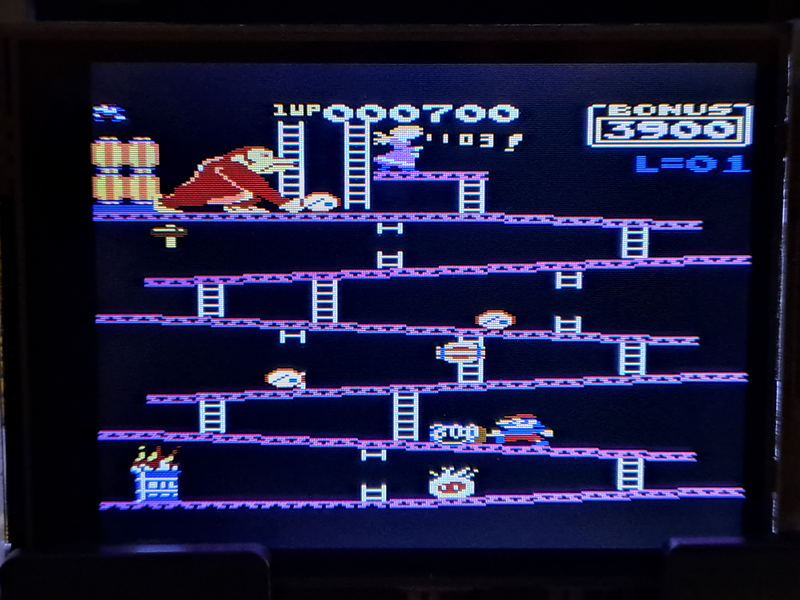
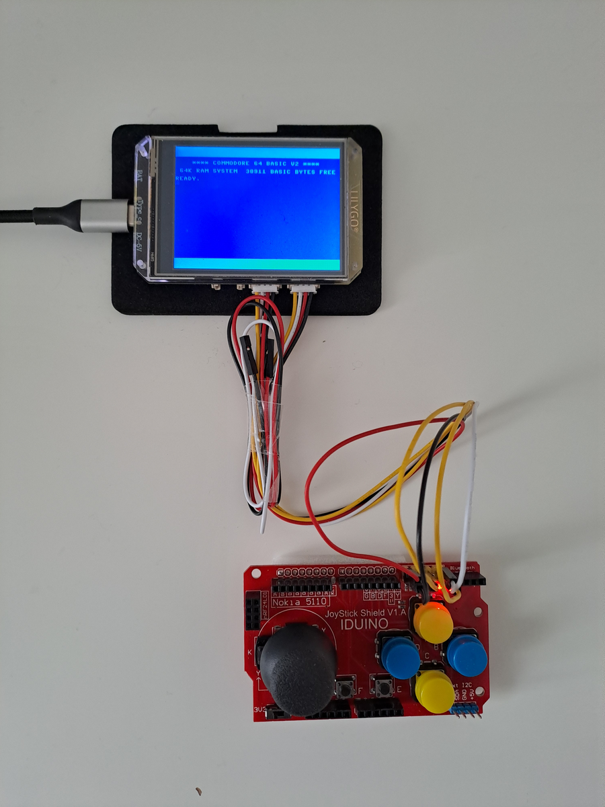
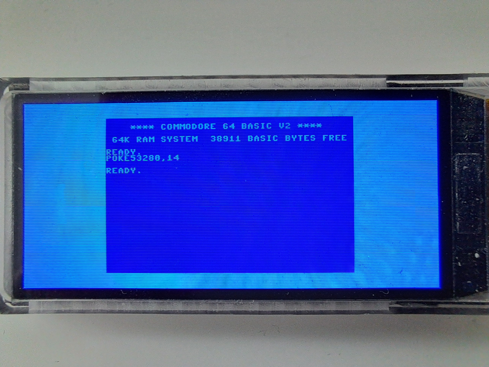
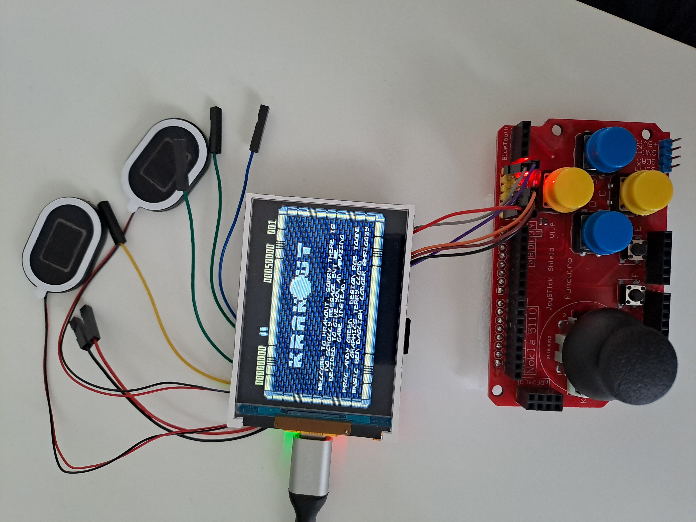
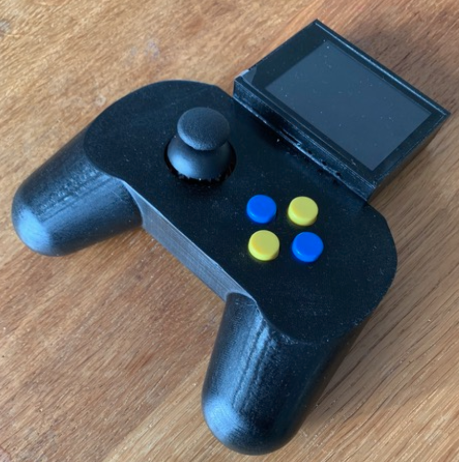
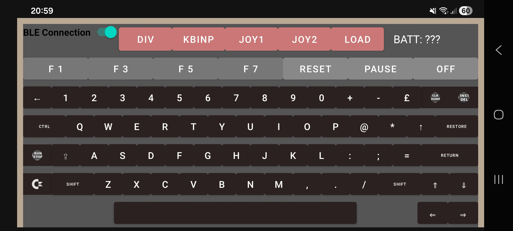
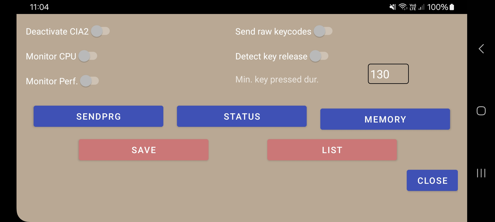
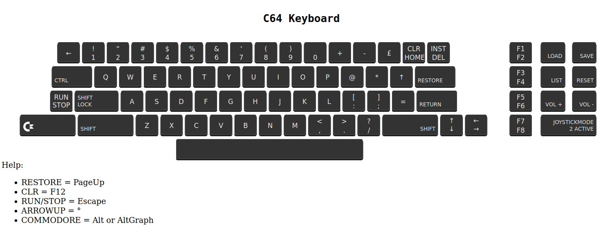
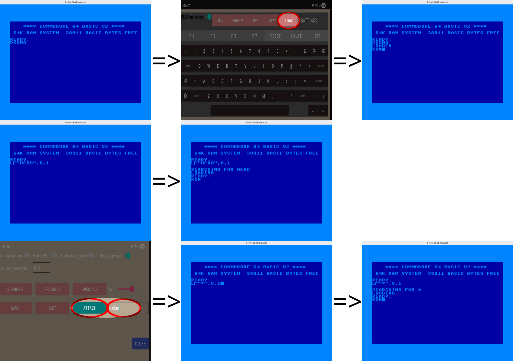
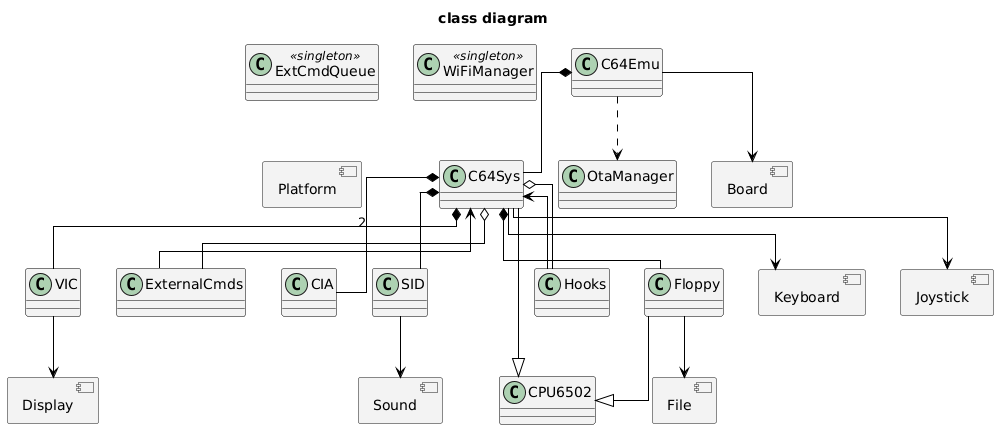

# C64 Emulator for ESP32-S3 (and ESP32) with "Android BLE keyboard" or "Web keyboard"

A C64 emulator developed for the  [Lilygo T-HMI](https://lilygo.cc/products/t-hmi?srsltid=AfmBOorPecASXq7SyOqsX45fdQunicyf2Bg8MDc_GLFPwDzk0vfWwCg7) development board, featuring an ESP32-S3 chip, a 2.8-inch touch LCD, and an SD card slot.
The emulator was later expanded to support the
[Lilygo T-Display S3 AMOLED](https://lilygo.cc/products/t-display-s3-amoled?srsltid=AfmBOoq3R6k7Wx7UcW6C1HozzFvwgN2AkHtXgrbJKdD2U9mv75vTSvJI), the [ESP32-S3-LCD-2.8 from Waveshare](https://www.waveshare.com/product/esp32-s3-touch-lcd-2.8.htm)
and the [ESP32 CYD board](https://github.com/witnessmenow/ESP32-Cheap-Yellow-Display).
The emulator is also running on an ESP32-S3 with a 64x64 or a 128x64 LED matrix panel.

Keyboard input is implemented via a custom Android app or via a web interface.  
The Android app communicates with the emulator via Bluetooth Low Energy (BLE).
The web keyboard was provided by uliuc@gmx.net.  
Further a "joystick-only" operation is possible for most games.

The code should also be portable to other ESP32-S3 boards (and even other platforms).

The emulator is also available as a Linux, Mac and Windows application using SDL for graphics, input, and sound.

[](https://youtu.be/OmPJlIjszpE)


Contact: retroelec42@gmail.com

## News

- Arduino core 3.3.10
- OTA
- Upload code/data to C64 RAM via Wi-Fi

## Hardware

<details>
<summary>Click to expand details</summary>

### ESP32-S3

The ESP32-S3 is dual core containing a protocol CPU (core 0) and an application CPU (core 1).
The two cores are identical in practice and share the same memory.
The tasks responsible for handling wireless networking (Wi-Fi or Bluetooth) are pinned to core 0 by default
(see [Espressif - Task Priorities](https://docs.espressif.com/projects/esp-idf/en/v5.0/esp32s3/api-guides/performance/speed.html)).

For this project core 0 is used to copy the graphic bitmap to LCD.
Emulation of the CPU and the custom chips (VIC, SID and CIAs) are done on core 1.

### Joystick

I use an "Arduino joystick shield".
The joystick is optional (as there exists also a virtual joystick on the Android device) but recommended.
It has an analog 2-axis thumb joystick and several buttons.
As there are several games which use the space bar as a second fire button, another button of the Arduino joystick
can be used to simulate the pressing of the space bar.

### BLE Joystick

In addition to the C64 emulator, there is also a BLE joystick application (ino file) for the ESP32-S3.
This involves pairing an "Arduino joystick shield" with an ESP32-S3 (or another ESP32-compatible device with BLE) to function as a BLE client.

### Battery

You can also operate your board with a battery. The T-HMI and Waveshare development boards allow you to switch on the board by pressing
the On/Off switch (next to the SD card slot). The boards can be switched off with the reset button, *if* it is powered by battery.
Alternatively, the Android app allows the board to be switched off by pressing the Off switch in the top right-hand corner.

### Lilygo T-HMI

This board uses a 2.8-inch LCD with a resolution of 240x320 pixel.
The display can be rotated to support the resolution of a C64 (320x200).



Joystick connections:

- connect T-HMI IO16 to Arduino joystick Y pin (yellow cable)
- connect T-HMI IO15 to Arduino joystick X pin (white cable)
- connect T-HMI VDD to Arduino joystick V pin (red cable)
- connect T-HMI GND to Arduino joystick G pin (black cable)
- connect T-HMI IO18 to Arduino joystick D pin (for D button, yellow cable)
- optional: connect T-HMI IO17 to Arduino joystick B pin to simulate pressing the space bar (for B button, white cable)

Switch voltage to 3.3V on the Arduino joystick module.

### T-Display S3 AMOLED

The board has no SD card but you can send a programm from your Android device to the emulator (see below).



### Waveshare ESP32-S3-LCD-2.8

This board has audio output.



Joystick connections:

- connect Waveshare IO18 to Arduino joystick Y pin (violet cable)
- connect Waveshare IO15 to Arduino joystick X pin (gray cable)
- connect Waveshare 3V3 to Arduino joystick V pin (red cable)
- connect Waveshare GND to Arduino joystick G pin (black cable)
- connect Waveshare IO11 to Arduino joystick D pin (for D button, orange cable)
- optional: connect Waveshare IO10 to Arduino joystick B pin to simulate pressing the space bar (for B button, brown cable)

Switch voltage to 3.3V on the Arduino joystick module.

#### Enclosure for the Waveshare Board

uliuc@gmx.net has created a gamepad for the Waveshare board.



The files for this are located in the directory named "enclosure".
If you have any questions about the gamepad, please contact Uli directly.

### CYD

The "Cheap Yellow Display" (CYD) board (ESP32-2432S028) runs with an ESP32 (unlike the boards above, which use an ESP32-S3).  
The board has too little RAM to activate Bluetooth or Wi-Fi. Therefore, the emulator can only be operated in "joystick-only" mode.
The "joystick-only" mode is activated pressing the fire button for two seconds.
The CYD board only has three free GPIO pins, so there is no pin for a second fire button.  
Furthermore, the LCD and SD card share the same SPI bus, resulting in a small amount of additional code in central routines.  
The sound quality is not particularly good.  
Due to performance issues with the ESP32 using Arduino core 3.3.10, binaries are built using Arduino core 3.2.0.


Joystick connections:

- connect CN1, IO27 to Arduino joystick Y pin (yellow cable)
- connect P3, IO35 to Arduino joystick X pin (yellow/white cable)
- connect CN1, 3V3 to Arduino joystick V pin (red cable)
- connect CN1, GND to Arduino joystick G pin (black cable)
- connect CN1, IO22 to Arduino joystick D pin (for D button, blue cable)

Switch voltage to 3.3V on the Arduino joystick module.

### ESP32-S3-WROOM with a 64x64 or a 128x64 LED matrix panel

The following pins of a standard ESP32-S3-WROOM module are connected to a 64x64 LED matrix panel as follows:

| Wroom pin | HUB75 pin |
| --------- | --------- |
| 4         | R1        |
| 5         | B1        |
| 6         | R2        |
| 7         | B2        |
| 15        | CH_A      |
| 16        | CH_C      |
| 41        | CLK       |
| 39        | OE        |
| 17        | G1        |
| GND       | GND       |
| 18        | G2        |
| 8         | CH_E      |
| 3         | CH_B      |
| 46        | CH_D      |
| 40        | LAT       |
| GND       | GND       |

Because the resolution of the LED matrix display is too small, either only a section is displayed or it is "scaled".
The following modes are available:

- pixel area follows sprite (slow)
- pixel area follows sprite (fast)
- scale mode "merge x pixels"
- scale mode "extract each x. pixel"

The modes can be changed using the BLE keyboard, DIV screen, SPECIAL1 button.
For the "pixel area follows sprite" modes the sprite to be followed can be determined using the BLE keyboard, DIV screen, SPECIAL2 button.


</details>

## Installation

<details>
<summary>Click to expand details</summary>

### Files

- THMIC64KB/thmic64kb.apk : Android APK file to be uploaded to your Android smartphone
- arduino/C64Emu/C64Emu.ino : Arduino .ino file of the C64 emulator
- arduino/BLEJoystick/BLEJoystick.ino : Arduino .ino file of the BLE joystick
- src/* : C64 emulator source code
- THMIC64KB/app/src/ : source code of Android app
- Makefile : used to install development environment and to compile + upload code
- enclosure/* : stl and scad files for the gamepad by uliuc@gmx.net

### Install environment (optional)

- Download arduino-cli for your platform (e.g. https://downloads.arduino.cc/arduino-cli/arduino-cli_latest_Linux_64bit.tar.gz for linux),
  unpack the binary and place it in a directory included in the search path of executables (e.g. /usr/local/bin on linux).
- You may have to install python3 and python3-serial if not already installed. On my linux system I had to install python3-serial:  
  sudo apt install python3-serial
- You may have to install GNU make if not already installed.
- You may have to adapt the file Makefile and change the name of the serial port (adapt variable PORT).
- On a linux system you may have to add the group dialout to your user to be able to upload code as a normal user:  
  sudo usermod -a -G dialout your-username  
  (you have to logout and login again to get the group get active) *and* you may have to change the access rights:  
  sudo chmod 666 /dev/ttyACM0
- You must install the required Arduino core and libraries using the following command in the directory T-HMI-C64
  (however please be aware that you could overwrite an already installed specfic Arduino core, see also next chapter):  
  make install

### Compile code (optional)

You first have to install the environment (see previous chapter).
You then adapt the Makefile and choose

- the board you want the code to be compiled for (adapt variable BOARD)
- the keyboard type: Android BLE keyboard, web keyboard (adapt variable KEYBOARD)

The web keyboard requires the following libraries for a successful compilation: ArduinoJson, AsyncTCP, ESPAsyncWebServer and ESPAsyncDNSServer.
The libraries AsyncTCP, ESPAsyncWebServer and ESPAsyncDNSServer need to be installed from their respective GitHub pages, as the versions available
in the standard Arduino Library Manager are outdated and incompatible with the current source code of this project.

If you installed the required Arduino core and libraries on your system (see also previous chapter),
you can compile the code using the following command:  
make  
(you may need to use ‘make clean’ beforehand if classes have been renamed or only the Makefile has been changed)

You may have installed already a specfic Arduino core for other projects (e.g. Arduino core 2.0.x) and you don't want to change this setup.
For this situation you can use a prepared docker image to compile the code:

- install podman
- get prepared docker image: podman pull docker.io/retroelec42/arduino-cli-thmic64:latest
- compile using docker image: make podcompile

### Upload C64 Emulator to the development board

If you installed the environment and compiled the code yourself:
To upload the compiled code to a board, you first adapt the file Makefile and choose the board and the keyboard type
you want the binary files to be uploaded for (adapt variables BOARD and KEYBOARD).
Furthermore, you may need to adjust the PORT variable.
Afterwards you can upload the binary files:  
make upload

In repeated cases, the upload can also take place via OTA. In this case, the following command can be issued:  
make uploadOTA

Binary files for the development boards can also be downloaded from https://github.com/retroelec/T-HMI-C64/actions
(select the latest run to see the artifacts, you must be logged in to download the binary files).
Alternatively, you can also download the files from https://github.com/retroelec/T-HMI-C64/releases
(you do not need to be logged in for this, however, the latest binaries may not be available here).
So you don't have to compile the binary files yourself if you don't want to.
The available zip files also contain scripts (flash.sh and flash.bat) to upload the binary file (see also README.md in the zip file).

### Compile and upload code for the BLE joystick

There is no binary available for the BLE joystick application. This means the code must be compiled and uploaded manually.
First, the development environment must be installed (see above) and the Makefile modified (and possibly a new board defined).
Then, the code can be compiled using `make compileBLEJoystick` and uploaded using `make uploadBLEJoystick`.

### Install Android App

I wrote an Android app which provides a BLE keyboard for the emulator.



However, this app is not available in the Google Play Store - you have to download the APK file
and install it "manually".
You may follow these steps to install the app on your Android device (there may be slight variations depending on your smartphone).

1. Allow installation of APK files from unknown sources:
   - Go to "Settings" on your Android device.
   - Navigate to "Security and Privacy".
   - Navigate to "Additional Security Settings".
   - Navigate to "Install Unknown Apps". A list of installed apps appears. Allow Chrome to install unknown apps.
2. Download the APK file to your Android device: Click [here](https://github.com/retroelec/T-HMI-C64/blob/main/THMIC64KB/thmic64kb.apk)
3. After the app has been downloaded, a message appears which allows you to open the file.
   Click on open and follow the on-screen instructions to complete the installation.

### Build emulator for Linux / Mac / Windows

To build the Linux / Mac version, you need to have the GNU C++ compiler and GNU Make installed.
You also need the SDL2 development libraries, which can be installed with:  
Linux: sudo apt install libsdl2-dev  
Mac: brew install sdl2

Once the dependencies are installed, you can compile the emulator using:  
Linux: make c64linux  
Mac: make c64mac

The emulator can be started using ./c64linux / ./c64mac in a shell.

Follow these steps to build the emulator for Windows:  

- Install podman (or alternatively docker)
- Get docker image: podman pull docker.io/retroelec42/sdl2-cross:latest
- Create executable: make c64win.exe

The windows exe can also be downloaded from https://github.com/retroelec/T-HMI-C64/actions
or https://github.com/retroelec/T-HMI-C64/releases.

Under Windows, the emulator consumes a relatively large amount of CPU time due to busy waiting, as the available sleep functions
are too coarse.
(The CPU time on Windows can be reduced by commenting out #WINDOWS_BUSYWAIT in Config.h, however this results in a delay in audio output.)

</details>

## Usage

<details>
<summary>Click to expand details</summary>

### Android keyboard

If you choosed the BLE keyboard (Makefile: KEYBOARD := BLE_KEYBOARD), the emulator starts a BLE server to receive
keystrokes from the Android client.

Once the app is installed and launched, you must accept the requested permissions once
(access to the precise location (*not* coarse location), permission to search for BLE devices).
If you start the emulator (i.e. power on the board) before starting the app, the app will automatically connect to the BLE server.
Otherwise you can move the "BLE connection" switch to the right to connect to the BLE server. You also have to do this manually
after "hardware reseting" the development board.

As it is not possible to press two keys together on the Android keyboard, the keys Shift, Ctrl and Commodore are special keys
which usually are pressed first, followed by another key to simulate the corresponding key combination.

If it is necessary to send the raw key code of these special keys, you have to
set the corresponding switch in the Android app ("Send raw keycodes", DIV screen).

The key combination Run/Stop + Restore has been replaced by first pressing the Commodore key and then pressing the Restore key.

Besides the normal C64 keys this virtual keyboard also provides some extra buttons:

- DIV: opens an extra screen with some settings / extra functionality
- KBINP: opens an extra screen with further input options ("virtual joysticks" and "pinball flippers")
- JOY1: connected joystick can be used as a joystick in port 1
- JOY2: connected joystick can be used as a joystick in port 2
- LOAD: load a C64 program from SD card
- RESET: reset C64 emulator
- PAUSE: pause emulation
- OFF: switch off development board

#### DIV screen



Extra functionality and some settings are available in the DIV screen.

#### Virtual Joystick

The virtual joystick has some drawbacks in terms of responsiveness.
To play games, a hardware joystick is recommended.

#### Pinball flippers

Because it is difficult to keep an eye on the screen and press the right keys on the virtual keyboard at the same time for pinball games,
the flippers of “David's Midnight Magic” have been outsourced to a separate screen.
When you open this screen, the options "Send raw keycodes" and "Detect key release" are automatically enabled.
When you close this screen again, both options are reset to the previous values.

### Web keyboard

If you choosed the web keyboard (Makefile: KEYBOARD := WEB_KEYBOARD), the emulator starts a web server to allow
keyboard input using a web interface.

To ensure flexibility and security, the ESP32-S3 development board utilizes a dynamic Wi-Fi provisioning system.
This avoids the need to hardcode sensitive credentials during compilation. The process follows a structured fallback logic:

- Credential Retrieval: Upon startup, the system attempts to retrieve the SSID and password from the non-volatile memory (NVRAM) using the Arduino Preferences library.
- Connection Attempt: The board attempts to establish a connection to the stored local network in Station (STA) mode.
- Fallback to Access Point (AP): If the connection fails or no credentials are found, the board automatically initializes as an Access Point (AP).
To configure the device, you must manually disconnect your smartphone or computer from your current Wi-Fi and connect it to the ESP32's broadcasted
network (T-HMI-C64). Once connected, use the default IP address to access the configuration interface: http://192.168.4.1.
- Provisioning & Persistence: The web interface provides a list of available networks for the user to select and enter credentials. Once submitted, these values are securely stored in the NVRAM.
- Reboot & Initialization: After saving the new credentials, the ESP32-S3 performs a software reset. On the subsequent boot, it uses the newly stored data to connect to your normal Wi-Fi network.

The keyboard is then accessed via the URL http://"ip-address-of-your-esp32s3" on standard port 80.
If you have selected the web keyboard, the IP address of your development board will be displayed on the C64 screen at startup.
The GUI itself is self explaining.



### "Joystick-only" operation

The joystick can also be used to load and launch single filed games, eliminating the need for a keyboard:

- Open OSD Menu: Press and hold fire button 2 (fire button 1 for the CYD board) for 2 seconds.
- Close OSD Menu: Press fire button 1.

Menu navigation (post-reset):

- Browse games: Move down to scroll through your library.
- Launch game: Move left to load and auto-run the selected game (supports .prg files only, closes menu automatically).
- Select joystick port: Move right to toggle between port 1 and port 2.
- Power off: Move up to shut down the development board.

While a game is running, the OSD allows you to trigger essential commands:

- Scroll through "important" keys: Move left to scroll trough a fixed set of keys.
- Send chosen key: Move down to emulate pressing the chosen key.
- Swap ports: Move right to switch joystick ports on the fly.
- System reset: Move up to perform a hard reset of the emulator (closes menu automatically).

Hint: Pressing the spacebar can usually also be simulated by pressing the joystick's fire button
(button 1 for joystick in port 1, button 2 for joystick in port 2).

### BLE joystick

The emulator supports two different joystick interfaces: a "hardware joystick" (connected directly to the ESP32-S3) and a "BLE joystick" (or "keyboard joystick").
Once the "BLE joystick" has connected to the C64 emulator, it is automatically configured as a port2 joystick.
Pressing the "JoyOnlyMode button" (usually the fire2 button) for at least 2 seconds will change the joystick port.

If both a "hardware joystick" and a "BLE joystick" are available, then games for two players can also be played.

### Load a program from SD card

You first have to copy C64 games in prg or d64 format to an SD card
(game names must be in lower case letters, max. 16 characters, no spaces in file names allowed, extension must be ".prg" or .d64, e.g. dkong.prg).
You have to insert the SD card before you power on the development board.

You then have the following options to load a program:



1.  You can load a prg file into memory using an "external command":
    First type in the name of the program (without extension ".prg"!) so it shows up on the C64 text screen (e.g. dkong).
    You then press the LOAD button (cursor must be on the same line and behind or in the middle of the game title).
    If the file is found the text "LOADED" appears on screen, otherwise the text "FILE NOT FOUND" appears.
    Afterwards, as usual, you can start the game by typing "RUN" followed by pressing the button RETURN.
2.  You can also load a prg file into memory using the C64 Load command:  
    LOAD"DKONG",8,1  
    This will load the file dkong.prg.
3.  If you are using the BLE keyboard, you also can attach a ".d64" file using the ATTACH button on the DIV screen.
    You can then use LOAD"$",8 to load the directory and subsequently load a specific program or
    you can load the first file from disk using LOAD"*",8,1.

### Save a program to SD card

Type in the name of the program so that it appears on the screen. Then press the SAVE button to save the program.

### List programs on SD card

The LIST button shows the programs on the SD card in a paginated list.

### Send a program by BLE

You can also send a programm from your Android device to the emulator (DIV screen, SENDPRG Button).

### Send a program by Wi-Fi

You can also send a program to the emulator via Wi-Fi by using the Python script wifi_upload.py.

### Config file

Optionally, a .config.json file can be copied to the SD card (resp. to the c64prg directory for the Linux/Mac/Windows version).
The following example shows the configuration options:

- automatically load and start game "dkong"
- set keyboard layout for the SDL version of the emulator (possible values: "ch", "de", "us")
- add additional keycodes to send to the emulator in joystick-only mode


```json
{
  "version": 1,

  "autostart": "dkong",

  "sdlkeyboardlayout": "ch",

  "joystickOnly": {
    "keycodes": [
      {
        "text":    [32, 6, 53],
        "c64keycode": "C64_KEYCODE_F5"
      },
      {
        "text":    [32, 6, 55],
        "c64keycode": "C64_KEYCODE_F7"
      }
    ]
  }
}
```

### Linux / Mac / Windows

- Create a subdirectory c64prgs in the directory containing the executable
- Copy the c64 rom/disk files (.prg and .d64) to this directory
- Configure the keyboard layout in a file .config.json (see previous chapter) and copy it also to this directory
- Start the emulator
- Press rctrl + h in the emulator window to display a simple help page on the emulated C64 screen
- You can use rctrl-a to attach a .d64 file
- You can use rctrl-k and rctrl-j to configure a keyboard joystick and a "real" joystick offering the possibilty to play two player games

</details>

## Software

<details>
<summary>Click to expand details</summary>

### Class diagram of the emulator



component details:
[Platform Board](doc/classdiagram_001.png)
[Keyboard Joystick](doc/classdiagram_002.png)
[Display Sound File](doc/classdiagram_003.png)

### Keyboard

Keyboard inputs are sent to the ESP32-S3 via BLE or Wi-Fi. Three bytes must be sent for each key press:

- Value for the $DC00 register
- Value for the $DC01 register
- Control code:
  - Bit 0 is set when a shift key is pressed
  - Bit 1 is set when the ctrl key is pressed
  - Bit 2 is set when the commodore key is pressed
  - Bit 7 is set when an "external command" is sent

### Porting to other ESP32-S3 development boards

To support a different ESP32-S3 based development board, follow these steps:

- Add a new configuration entry in Config.h to identify the new board.
- Implement any missing drivers: If your board requires custom implementations of the provided driver interfaces (e.g. board, display, sound),
  create new driver classes accordingly.
- Extend the corresponding driver factory to return the appropriate driver implementations for your new board.

### Emulation status

First of all: This is a hobby project :)

Features not emulated (list not exhaustive) resp. known bugs:

- simple SID emulation, some SID registers are not or only partly implemented yet: $d415 - $d41c
- only very rudimentary support for disk drive emulation available
- "illegal instructions" test suite fails
- no "FLI border removal" / "sideborder removal"
- synchronization is rasterline-based, not cycle-exact
- rarly C64 CPU is blocked after loading a game
- CYD: modest sound, rarly display freezes after loading a game

Since only a rudimentary disk drive emulation is available, only a few "multi-load" games can be played
(e.g. Summer Games, World Games, The Dallas Quest).
Most of the single filed games tested work well. A few games have graphics glitches and a small number of the games tested do not work at all.

</details>

