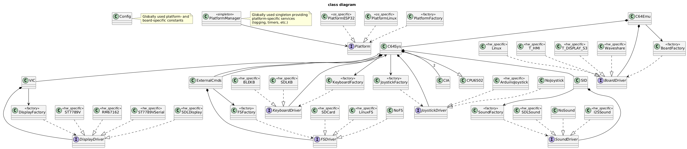

# C64 Emulator for ESP32-S3 with "Android keyboard" (BLE) or "Web keyboard" (Lilygo T-HMI, Lilygo T-Display S3 AMOLED, Waveshare ESP32-S3-LCD-2.8)

A C64 emulator developed for the  [Lilygo T-HMI](https://lilygo.cc/products/t-hmi?srsltid=AfmBOorPecASXq7SyOqsX45fdQunicyf2Bg8MDc_GLFPwDzk0vfWwCg7) development board, featuring an ESP32-S3 chip, a 2.8-inch touch LCD, and an SD card slot.
The emulator was later expanded to support the
[Lilygo T-Display S3 AMOLED](https://lilygo.cc/products/t-display-s3-amoled?srsltid=AfmBOoq3R6k7Wx7UcW6C1HozzFvwgN2AkHtXgrbJKdD2U9mv75vTSvJI) and the
[ESP32-S3-LCD-2.8 from Waveshare](https://www.waveshare.com/product/esp32-s3-touch-lcd-2.8.htm).

Keyboard input is simulated via a custom Android app, communicating with the emulator over Bluetooth Low Energy (BLE) or via a web interface.  
The web keyboard was provided by uliuc@gmx.net.

After extensive refactoring, the code should now be portable to other ESP32-S3 boards (and even other platforms).

The emulator is also available as a Linux and Mac application using SDL for graphics, input, and sound.  
On Windows, the emulator consumes a lot of CPU time due to busy-waits, since the available sleep functions are too coarse-grained.
Probably for the same reason, audio output is also slightly delayed.

Contact: retroelec42@gmail.com

## News

- Web keyboard by uliuc@gmx.net
- Rudimentary disk drive emulation

## Hardware

### ESP32-S3

The ESP32-S3 is dual core containing a Protocol CPU (core 0) and an Application CPU (core 1).
The two cores are identical in practice and share the same memory.
The tasks responsible for handling wireless networking (Wi-Fi or Bluetooth) are pinned to core 0 by default
(see [Espressif - Task Priorities](https://docs.espressif.com/projects/esp-idf/en/v5.0/esp32s3/api-guides/performance/speed.html)).

For this project core 0 is used to copy the graphic bitmap to LCD.
Emulation of the CPU and the custom chips (VIC, SID and CIAs) are done on core 1.

### Joystick

I use an "Arduino joystick shield" for the T-HMI and the Waveshare development board.
The joystick is optional (as there exists also a virtual joystick on the Android device) but recommended.
It has an analog 2-axis thumb joystick and several buttons.
As there are several games which use the space bar as a second fire button (e.g. Commando), another button of the Arduino joystick
can be used to simulate the pressing of the space bar.

### Battery

You can also operate your board with a battery. The T-HMI and Waveshare development boards allow you to switch on the board by pressing
the On/Off switch (next to the SD card slot). The Waveshare board can be switched off with the reset button, *if* it is powered by battery.
Alternatively, the Android app allows the board to be switched off by pressing the Off switch in the top right-hand corner.

### Lilygo T-HMI development board

From [Xinyuan-LilyGO/T-HMI](https://github.com/Xinyuan-LilyGO/T-HMI):

The 2.8 inch TFT LCD has a resolution of 240x320 pixel and an 8 bit parallel interface.

The display can be rotated to support the resolution of a C64 (320x200).

Joystick connections:

- connect T-HMI IO16 to Arduino joystick Y pin (yellow cable)
- connect T-HMI IO15 to Arduino joystick X pin (white cable)
- connect T-HMI VDD to Arduino joystick V pin (red cable)
- connect T-HMI GND to Arduino joystick G pin (black cable)
- connect T-HMI IO18 to Arduino joystick D pin (for D button, yellow cable)
- optional: connect T-HMI IO17 to Arduino joystick B pin to simulate pressing the space bar (for B button, white cable)

Switch voltage to 3.3V on the Arduino joystick module.

### T-Display S3 AMOLED board

The board has no SD card but you can send a programm from your Android device to the emulator (see below).

### Waveshare ESP32-S3-LCD-2.8

This board has audio output.

Joystick connections:

- connect Waveshare IO18 to Arduino joystick Y pin (violet cable)
- connect Waveshare IO15 to Arduino joystick X pin (gray cable)
- connect Waveshare 3V3 to Arduino joystick V pin (red cable)
- connect Waveshare GND to Arduino joystick G pin (black cable)
- connect Waveshare IO11 to Arduino joystick D pin (for D button, orange cable)
- optional: connect Waveshare IO10 to Arduino joystick B pin to simulate pressing the space bar (for B button, brown cable)

Switch voltage to 3.3V on the Arduino joystick module.

## Installation

### Files

- build_\*/\*.bin : Binary files of the C64 emulator to be uploaded to the respective development board
- THMIC64KB/thmic64kb.apk : Android APK file to be uploaded to your Android smartphone
- T-HMI-C64.ino : Arduino .ino file of the C64 emulator
- src/* : C64 emulator source code
- THMIC64KB/app/src/ : source code of Android app
- Makefile : used to install development environment and to compile + upload code

### Install environment

- Download arduino-cli for your platform (e.g. https://downloads.arduino.cc/arduino-cli/arduino-cli_latest_Linux_64bit.tar.gz for linux),
  unpack the binary and place it in a directory included in the search path of executables (e.g. /usr/local/bin on linux).
- You may have to install python3 and python3-serial if not already installed. On my linux system I had to install python3-serial:  
  sudo apt install python3-serial
- You may have to install esptool to flash the microcontroller if not already installed:  
  pip install esptool
- You may have to install GNU make if not already installed.
- You may have to adapt the file Makefile and change the name of the serial port (adapt variable PORT).
- On a linux system you may have to add the group dialout to your user to be able to upload code as a normal user:  
  sudo usermod -a -G dialout your-username  
  (you have to logout and login again to get the group get active) *and* you may have to change the access rights:  
  sudo chmod 666 /dev/ttyACM0
- Optional: You *can* install the required Arduino core and libraries using the following command in the directory T-HMI-C64
  (however please be aware that you could overwrite an already installed specfic Arduino core, see also next chapter):  
  make install

### Compile code (optional for Android BLE keyboard, mandatory for Web keyboard)

First adapt the file Makefile and choose

- the board you want the code to be compiled for (adapt variable BOARD)
- the keyboard type: Android BLE keyboard, Web keyboard (adapt variable KEYBOARD)

If you choose the Web keyboard, you also have to provide the credentials of your WLAN.
The credentials are transferred to the Makefile via environment variables (WLAN_SSID, WLAN_PASSWORD).

Under Linux, the environment variables can be set in a script (e.g. setenv.sh), for example:  
export WLAN_SSID="myssid”  
export WLAN_PASSWORD="mypasswd”

The script must then be executed with the "source" command so that the environment variables are available in the current shell, e.g.:  
source setenv.sh

The Web keyboard requires the following libraries for a successful compilation: ArduinoJson, AsyncTCP and ESPAsyncWebServer.
The libraries AsyncTCP and ESPAsyncWebServer need to be installed from their respective GitHub pages, as the versions available
in the standard Arduino Library Manager are outdated and incompatible with the current source code of this project.

If you installed the required Arduino core and libraries on your system (see also previous chapter),
you can compile the code using the following command:  
make  
(you may need to use ‘make clean’ beforehand if classes have been renamed)

You may have installed already a specfic Arduino core for other projects (e.g. Arduino core 2.0.x) and you don't want to change this setup.
For this situation you can use a prepared docker image to compile the code:

- install podman
- get prepared docker image: podman pull docker.io/retroelec42/arduino-cli-thmic64:latest
- compile using docker image: make podcompile

### Upload C64 Emulator to the development board

First adapt the file Makefile and choose the board you want the binary files to be uploaded for (adapt variable BOARD).
Binary files for the Android BLE keyboard variant are also part of the git repository, so you don't have to compile them yourself if you don't want to.
If you want to use the Web keyboard, you have to provide the credentials of your WLAN and compile the binary yourself.

Afterwards you can upload the binary files:  
make upload

### Install Android App

I wrote an Android app which provides a C64 keyboard for the emulator.

However, this app is not available in the Google Play Store - you have to download the APK file
and install it "manually".
You may follow these steps to install the app on your Android device (there may be slight variations depending on your smartphone).

1. Allow installation of APK files from unknown sources:
   - Go to "Settings" on your Android device.
   - Navigate to "Security and Privacy".
   - Navigate to "Additional Security Settings".
   - Navigate to "Install Unknown Apps". A list of installed apps appears. Allow Chrome to install unknown apps.
2. Download the APK file to your Android device: Click [here](https://github.com/retroelec/T-HMI-C64/blob/main/THMIC64KB/thmic64kb.apk)
3. After the app has been downloaded, a message appears which allows you to open the file.
   Click on open and follow the on-screen instructions to complete the installation.

### Web keyboard

The Web keyboard can be used as an alternative to the Android keyboard (e.g. for people who do not own an Android device).
It runs via Wi-Fi and requires the access data (credentials) to be specified (see chapter "Compile code").

### Install Emulator for Linux

To build the Linux version, you need to have the GNU C++ compiler and GNU Make installed.
You also need the SDL2 development libraries, which can be installed with:  
sudo apt install libsdl2-dev

Once the dependencies are installed, you can compile the emulator using:  
make c64linux

To start the emulator, run ./c64linux in a shell.
Press Alt + h in the emulator window to display a simple help page on the emulated C64 screen.

## Usage

### Android keyboard

The emulator starts a BLE (Bluetooth Low Energy) server to receive keystrokes from the Android client.

Once the app is installed and launched, you must accept the requested permissions once
(access to the precise location (*not* coarse location), permission to search for BLE devices).
If you start the emulator (i.e. power on the board) before starting the app, the app will automatically connect to the BLE server.
Otherwise you can move the "BLE connection" switch to the right to connect to the BLE server. You also have to do this manually
after "hardware reseting" the development board.

As it is not possible to press two keys together on the Android keyboard, the keys Shift, Ctrl and Commodore are special keys
which usually are pressed first, followed by another key to simulate the corresponding key combination.

If it is necessary to send the raw key code of these special keys, you have to
set the corresponding switch in the Android app ("Send raw keycodes", DIV screen).

The key combination Run/Stop + Restore has been replaced by first pressing the Commodore key and then pressing the Restore key.

Besides the normal C64 keys this virtual keyboard also provides some extra buttons:

- DIV: opens an extra screen with some settings / extra functionality
- KBINP: opens an extra screen with further input options ("virtual joysticks" and "pinball flippers")
- JOY1: connected joystick can be used as a joystick in port 1
- JOY2: connected joystick can be used as a joystick in port 2
- LOAD: load a C64 program from SD card
- RESET: reset C64
- OFF: switch off T-HMI development board

### Web keyboard

The keyboard is accessed via the URL http://"ip-address-of-your-esp32s3" on standard port 80.
The GUI itself is self explaining.

#### DIV screen

Extra functionality and some settings are available in the DIV screen.

#### Virtual Joystick

The virtual joystick has some drawbacks in terms of responsiveness.
To play games, a hardware joystick is recommended.

#### Pinball flippers

Because it is difficult to keep an eye on the screen and press the right keys on the virtual keyboard at the same time for pinball games,
the flippers of “David's Midnight Magic” have been outsourced to a separate screen.
When you open this screen, the options "Send raw keycodes" and "Detect key release" are automatically enabled.
When you close this screen again, both options are reset to the previous values.

### Load a program from SD card

You first have to copy C64 games in prg or d64 format to an SD card
(game names must be in lower case letters, max. 16 characters, no spaces in file names allowed, extension must be ".prg" or .d64, e.g. dkong.prg).
You have to insert the SD card before you power on the development board.

You can load a prg file into memory using an "external command".
To do this, you first type in the name of the program (without extension ".prg"!) so it shows up on the C64 text screen (e.g. dkong).
You then press the LOAD button on your Android phone (cursor must be on the same line and behind or in the middle of the game title).
If the file is found the text "LOADED" appears on screen, otherwise the text "FILE NOT FOUND" appears.
Afterwards, as usual, you can start the game by typing "RUN" followed by pressing the button RETURN.

You can also load a prg file into memory using the C64 Load command:  
LOAD"DKONG",8,1  
This will load the file dkong.prg.

Finally you can attach a ".d64" file using the ATTACH button on the DIV screen.
You can then use LOAD"$",8 to load the directory and subsequently load a specific program.
Note: The wildcard * to load the first program does not yet work.

Hint: You can use [D64 Editor](https://www.d64editor.com/) to extract prg files from d64 files (also works unter linux using wine).

### Save a program to SD card

Type in the name of the program so that it appears on the screen. Then press the SAVE button on the DIV screen to save the program.

### List programs on SD card

Just press the LIST button on the DIV screen. If more than 23 programs are stored on the SD card,
you can display all programs stored on the SD card by repeatedly pressing the LIST button.

### Send a program by BLE

You can also send a programm from your Android device to the emulator (DIV screen, SENDPRG Button).

## Software

### Class diagram of the emulator

component details:
[Platform Board](doc/classdiagram_001.png)
[Keyboard Joystick](doc/classdiagram_002.png)
[Display Sound File](doc/classdiagram_003.png)

### Keyboard

Keyboard inputs are sent to the ESP32-S3 via BLE. Three bytes must be sent for each key press:

- Value for the $DC00 register
- Value for the $DC01 register
- Control code:
  - Bit 0 is set when a shift key is pressed
  - Bit 1 is set when the ctrl key is pressed
  - Bit 2 is set when the commodore key is pressed
  - Bit 7 is set when an "external command" is sent

### Porting to other ESP32-S3 development boards

To support a different ESP32-S3 based development board, follow these steps:

- Add a new configuration entry in Config.h to identify the new board.
- Implement any missing drivers: If your board requires custom implementations of the provided driver interfaces (e.g. board, display, sound),
  create new driver classes accordingly.
- Extend the corresponding driver factory to return the appropriate driver implementations for your new board.

### Emulation status

First of all: This is a hobby project :)

Features not emulated (list not exhaustive) resp. known bugs:

- simple SID emulation, some SID registers are not or only partly implemented yet: $d415 - $d41c
- only very rudimentary support for disk drive emulation available
- "illegal instructions" test suite fails
- no "FLI border removal" / "sideborder removal"
- synchronization is rasterline-based, not cycle-exact
- rarly C64 CPU is blocked after loading a game

Since only a rudimentary disk drive emulation is available, only a few "multi-load" games can be played (e.g. Summer Games, World Games, The Dallas Quest).
Most of the single filed games tested work well. A few games have minor graphics glitches and a small number of the games tested do not work at all.

